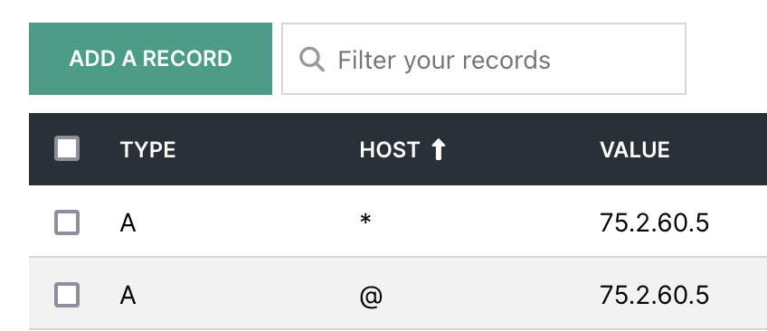

# 💯 Challenges

### Challenge 1 : Content. Content. Content.

* `Homepage`. It's your site. Have fun with it.
* `About` page with your bio, super power, goals, etc.
* Three(3) `Posts` or `Projects`. Or Both
* Any additional content you'd like

### Challenge 2: Templat-ing

* DO NOT statically “hard code” the data
* DO NOT make pages with repeating content
* Do Not repeat yourself aka _DRY Principles_.
* Use the frameworks component templating
* Use the frameworks dynamic data
* Use the frameworks API featuresf

### Challenge 3 : Style It.

* Determine styling for yourself
* Customize the templates - see below - as you like
* It's your site. Have fun with it.

### Challenge 4 : Code

* Option A : Digital Garden Template
  * Pro: We made it in class.
  * Con: In class, bare-bones, template
  * https://github.com/ewuweblab/digital-garden-template
* Option B: Prebuild Astro Themes
  * Pro: Look great with many features
  * Con: More complicated
  * https://astro.build/themes/
* Option C: DIY'it.
  * Pro: DIY
  * Con: DIY

### Challenge 5 : Process

* [ ] Provide URL to your project _repo_ stored on _GitHub_
  * Example: \*[https://github.com/**YourUserName**/**RepoName**\*](https://github.com/**YourUserName**/**RepoName***)
* [ ] Provide URL to your project website deployed via _Netflify_
  * Example: _https://**YourAppName**.netlify.com_

### Challenge 6 : Custom Domain Name

* Extra Credit
* Buy a custom domain name from Hover.com
* Point it to your Netlify site

<figure><figcaption></figcaption></figure>
